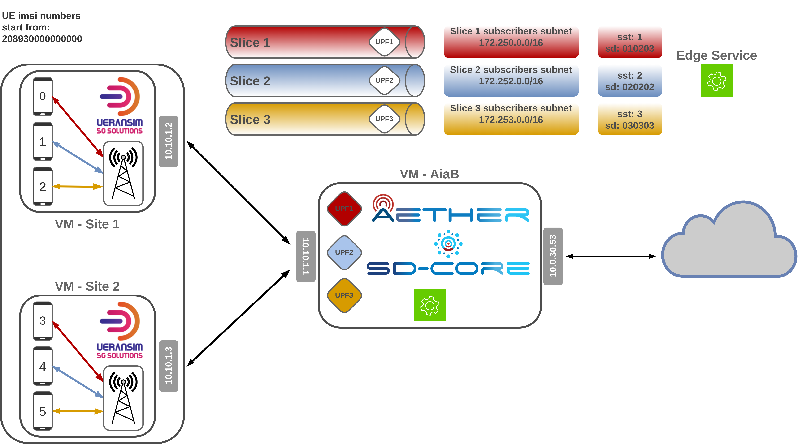
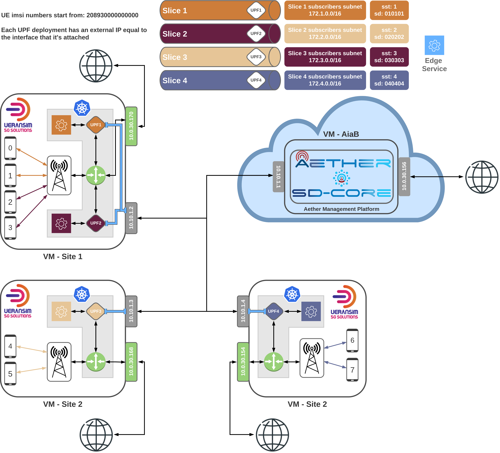

# Setting up Aether-in-a-Box with UERANSIM.
This guide is an expansion on the one provided in the [ONF's SD-Core UERANSIM documentation](https://docs.sd-core.opennetworking.org/master/deployment/deploymentueransim.html), therefore it will assume that both VM's are setup and the base case scenario documented (uesimtun0 ping test) is working.
The config files for all the UERANSIM gNb's and UE's are also provided in this repository as well as a simple speedtest python script.
As of yet, no edge services are deployed but, hopefully, will be in the future, in order to ilustrate an Aether Connected Edge (ACE) and how a local breakout is created.

[UPF Setup](/scenario_1//README.md) in the same VM as AiaB.

[UPF Setup](/scenario_2/README.md) in a new VM (simulated edge).

---

# Network Scenarios Overview

## Scenario 1
The network depicted below has two different VM's running UERANSIM and 3 different UPF's. 
These UPF's are running in the same VM and cluster as all of the other AiaB resources, meaning that all UERANSIM UE's traffic towards the Internet has to leave their VM's and be NATed in the AiaB VM.

## Scenario 2
In this scenario, a new VM is created to ilustrate yet another edge site.
This time the UPF's are deployed in the UERANSIM VM's thus creating a very simple ACE, with local internet access, meaning the UE's traffic towards the Internet don't ever leave this VM, nor will the traffic towards the edge service.
Even though it's depicted in the image, an edge service has not been yet deployed.
It is also shown 2 UPF's in the first edge site, but i've only managed to deploy one, nonetheless, it is future work.

