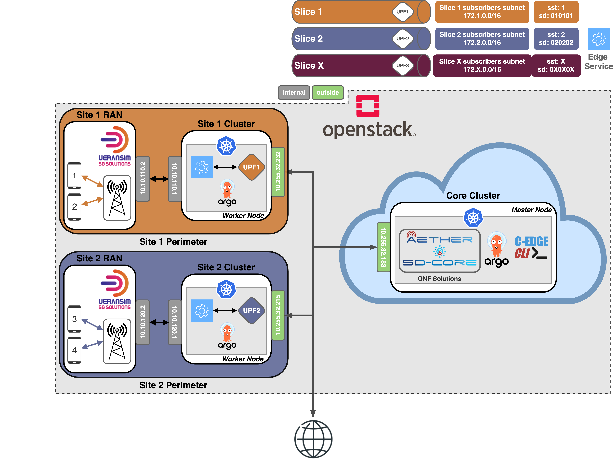

# Aether + UERANSIM | Scaling Aether User Plane for multiple Edge sites.
This guide is an expansion on the one provided in the [ONF's SD-Core UERANSIM documentation](https://docs.sd-core.opennetworking.org/master/deployment/deploymentueransim.html), therefore it will assume that both VM's are setup and the base case scenario documented (uesimtun0 ping test) is working.
The config files for all the UERANSIM gNb's and UE's are also provided in this repository.

This scenario was based and extended [Aether-in-a-Box](https://docs.aetherproject.org/master/developer/aiab.html), which is now a defunct project, with its successor being [Aether OnRamp](https://docs.aetherproject.org/master/onramp/overview.html). 
Because of that, it now incorporates some of Aether OnRamp base respositories ([aether-amp](https://github.com/opennetworkinglab/aether-amp) and [aether-k8s](https://github.com/opennetworkinglab/aether-k8s)) for the management of the Aether ROC and K8s Cluster creation, respectively.

In the [scenario](/scenario/README.md) directory are all the steps and configuration files needed to reach the scenario depicted in the image below.
---

# Network Scenario Overview

The scenario is characterized by having 3 main components, the Central Cloud (Core) and 2 Edge Sites (Aether Connected Edges).
These edge sites are instantiated with the help of the [C-Edge CLI](https://github.com/dot-1q/cedge-cli), and ArgoCD, where the former abstracts the steps to cerate the UPFs and Slices, and the latter aids in deploying the UPFs helm charts in the desired edge cluster.

Since this scenario employs the GitOps paradigm, leveraged by ArgoCD, the deployments that make up the network  are all available [here](https://github.com/dot-1q/5g_connected_edge)

[Link](https://hub.docker.com/r/802dot1q/edgeservice) to the edge service. It is a very basic and is meant to illustrate an effective edge service. It simply recived and forwards messages through an UDP connection.

The following excerpt is taken from my thesis, and is meant to fully explain each component present in the image above. All the infrastructure used was provided to me by [IT Aveiro](https://www.it.pt).

*"Each slice colour-coded box represents an edge site, and its own perimeter, meaning that such slice will be present in that site, and only that site. Furthermore, each box contains two more individual white boxes (each of them a different virtual machine) meant to represent the RAN and the computing infrastructure of that edge site, where the latter contains the Kubernetes cluster responsible for hosting the network functions that enable the edge site connectivity, and the direct connection to the internet, effectively creating the local breakout of that edge site. Additionally, the grey box encompassing the Core, Site two and three Perimeter, indicates that all of these components are completely virtualized inside OpenStack virtual machines. [...] The slices created for this scenario do not contain prior QoS distinction between them, nor limitation in their bandwidth, being created with the sole purpose of demonstrating Aether's implementation of such concept.*

*The virtualized components that comprise the scenario residing on an Openstack-enabled platform are as follows: the virtual machines for the site two and three as well as for the core are running Ubuntu 20.04 with the Core virtual machine using 8 VCPU's, 16GB of RAM and 100GB of internal storage, whereas site two and three are using 2 VCPU's and 4GB of RAM. The virtual machines that are running the emulated RAN (Site two and three RAN) have 2 VCPU's, 2GB of RAM.*

*All clusters in the scenario are based on the [RKE2](https://docs.rke2.io) Kubernetes distribution, with Skupper and ArgoCD being deployed on each cluster. The Core cluster additionally has the SD-Core control plane and Aether ROC containers, whereas the sites' clusters only have the data plane containers UPF and edge services.*

*Every site illustrated in the Figure above is meant to represent an independent edge site, which could be located in any geographical location, as long as it had Internet connectivity with the Core. Furthermore, each edge site implements its own local breakout, meaning its network traffic doesn't leave the site's premises and has its own UPFs and slices. Each site also has a layer 3 link to its corresponding RAN components, where all the traffic from and towards the UEs flows."*
