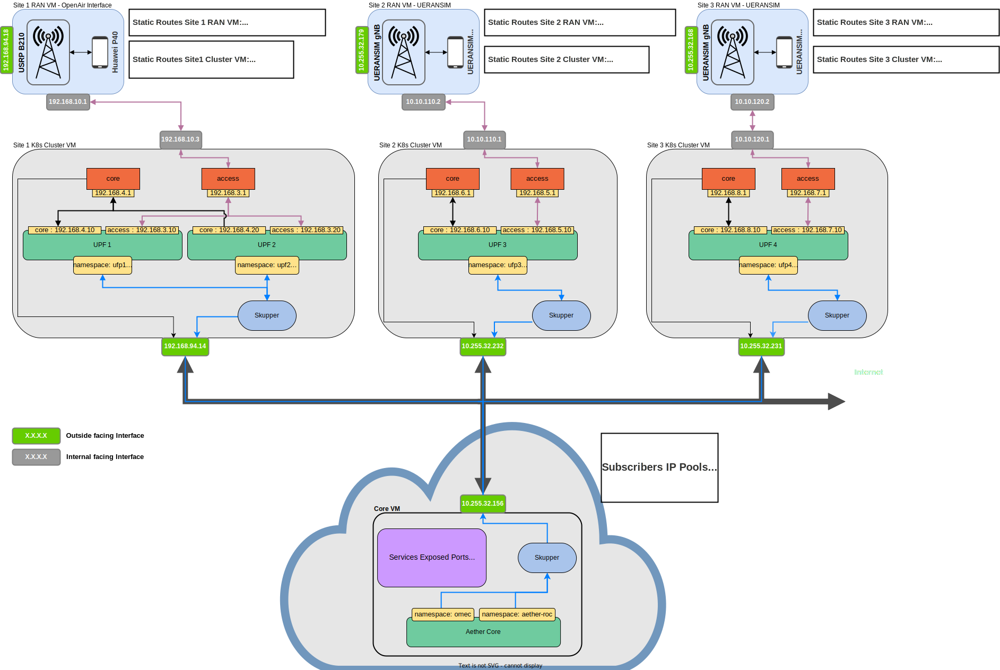

## Deploying the network with an edge site


| **UPF** | **Access Interface** | **Core Interface** | **Slice** |
|---------|----------------------|--------------------|-----------|
| 1       | 192.168.3.10         | 192.168.4.10       | 1         |
| 2       | 192.168.3.20         | 192.168.4.20       | 2         |
| 3       | 192.168.5.10         | 192.168.6.10       | 3         |
| 4       | 192.168.7.10         | 192.168.8.10       | 4         |

| **Slice** | **Subscribers Subnet** | **SST** | **SD** |
|-----------|------------------------|---------|--------|
| 1         | 172.1.0.0/24           | 1       | 010101 |
| 2         | 172.2.0.0/24           | 2       | 020202 |
| 3         | 172.3.0.0/24           | 3       | 030303 |
| 4         | 172.4.0.0/24           | 4       | 040404 |

With Aether, there's a one-to-one relationship between UPF and Slices. The two tables above map the different UPF's and Slices specifications.

---
Here will be detailed the steps to be able to deploy the Core (Central Cloud), and Edge Site 2. The steps for the other edge sites are the same, with minor changes having to be made, for example the UPF name, or its interfaces IPs.
In each directory representing each edge site and core, will be the helm charts for each component. In the core directory will also be present the roc-5g-models.json, that loads the ROC with the initial config for our scenario.

### Core (Cental Cloud)
1. Install RKE2 kubernetes distribution.

    You can follow [this guide](https://docs.google.com/document/d/1-BT7XqVsL7ffBlD7aweYaScKDQH7Gv5tHKt-sJGuf6c/edit#heading=h.9660fbbf0lyk), or simply clone the AiaB repository and install it with it's make file, which already simplifies the installation process, and will also download all the helm charts you'll need.

    ```
    git clone "https://gerrit.opencord.org/aether-in-a-box"
    cd ~/aether-in-a-box
    make node-prep
    ```
2. Expose AMF
    ```
    ...
    amf:
        # use externalIP if you need to access your AMF from remote setup and you don't
        # want setup NodePort Service Type
        ngapp:
            externalIp: "10.255.32.156" # Core VM IP Address
            port: 38412
    ```
3. Deploy Core components: Aether ROC and SD-Core respsectively
    ```
    CHARTS=latest make roc-5g-models
    CHARTS=latest make 5g-core
    ```

4. Install Skupper in _omec_ namespace. Simply follow their [wiki](https://skupper.io/start/index.html)

    This is the command i use for my deployment
    ```
    skupper init --enable-console --enable-flow-collector --ingress nodeport --ingress-host 10.255.32.156 --console-auth internal --console-user admin --console-password connected_edge --enable-cluster-permissions --namespace omec
    ```

5. [Optional] If you wish to use the C-Edge CLI, to be able to deploy things with just one command, you need to also install [ArgoCD](https://argo-cd.readthedocs.io/en/stable/getting_started/). I nodeport it to port 30001, its where C-Edge CLI sends the API requests.

### Edge Site
This is for Edge Site 2, but as said before, with minimal change, can be adpated to any edge site, or your scenario.

1. Install RKE2 kubernetes distribution.

    You can follow [this guide](https://docs.google.com/document/d/1-BT7XqVsL7ffBlD7aweYaScKDQH7Gv5tHKt-sJGuf6c/edit#heading=h.9660fbbf0lyk), or simply clone the AiaB repository and install it with it's make file, which already simplifies the installation process, and will also download all the helm charts you'll need.

    ```
    git clone "https://gerrit.opencord.org/aether-in-a-box"
    cd ~/aether-in-a-box
    make node-prep
    ```

2. [Optional] If you intend on using C-Edge CLI + ArgoCD for the deployment of the components, you need to now register this cluster within ArgoCD on the Core, so that it can be remotely deployed to. I wont list the specific commands, but what needs to be done is:
    - Add the edge site cluster credentials, present on the .kubeconfig file, to the .kubeconfig of the Core.
    - Within argocd, [register the new cluster](https://argo-cd.readthedocs.io/en/stable/getting_started/#5-register-a-cluster-to-deploy-apps-to-optional)

3. Create and assign addresses to the virtual interfaces that are required per the UPF. Change the *iface_name* to the interface name where the interfaces will be anchored on.
    ```
    sudo ip link add access link <iface_name> type macvlan mode bridge
    sudo ip link add core link <iface_name> type macvlan mode bridge
    sudo ip addr add 192.168.5.1/24 dev access
    sudo ip addr add 192.168.6.1/24 dev core
    sudo ip link set access up
    sudo ip link set core up
    ```
4. Change the UPF helm chart.
    ```
    ...
    enb:
      subnet: "10.10.110.0/24" #this is your gNB network, from where the packets arrive from
    access:
      iface: "<iface_name>" # Name of the host interface 
      ip: "192.168.5.10/24" #New IP address for UPF3 access interface
      gateway: "192.168.5.1"
    core:
      iface: "<iface_name>" # Name of the host interface 
      ip: "192.168.6.10/24" #New IP address for UPF3 core interface
      gateway: "192.168.6.1" 
    ... 
    ```

5. Add the static routes needed. THe first one redirects the subscribers traffic, and the second one applies NAT for it.
    ```
    sudo ip route add 172.3.0.0/16 via 192.168.6.10
    sudo iptables -t nat -A POSTROUTING -o <iface_name> -j MASQUERADE
    ```

### UERANSIM VM
The Ueransim VM only needs to change the files for the gNodeB and the UE, and simply add one static route towards the UPF (N3 interface) for the gNodeB.

Given that listing the whole gNodeB and UE configuration files here with their changes will clutter up the README, only the static route will required will be shown, but the configuration files will be provided in their respective repository.

  ```
  sudo ip route add 192.168.5.0/24 via 10.10.110.1
  ```
