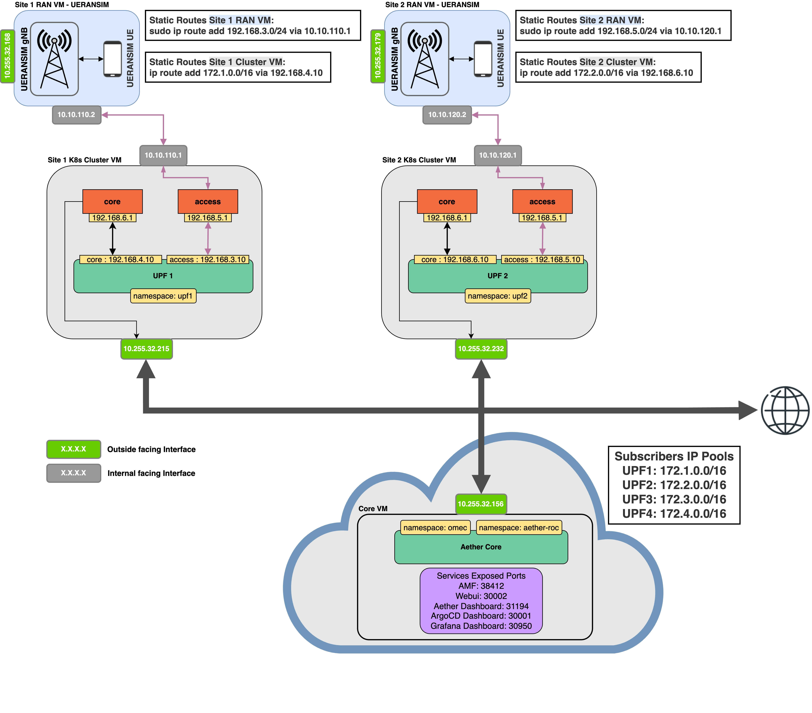

## Deploying the network with an edge site


| **UPF** | **Access Interface** | **Core Interface** | **Slice** |
|---------|----------------------|--------------------|-----------|
| 1       | 192.168.3.10         | 192.168.4.10       | 1         |
| 2       | 192.168.3.20         | 192.168.4.20       | 2         |

| **Slice** | **Subscribers Subnet** | **SST** | **SD** |
|-----------|------------------------|---------|--------|
| 1         | 172.1.0.0/24           | 1       | 010101 |
| 2         | 172.2.0.0/24           | 2       | 020202 |

With Aether, there's a one-to-one relationship between UPF and Slices. The two tables above map the different UPF's and Slices specifications.

---
Here will be detailed the steps to be able to deploy the Core (Central Cloud), and Edge Site 2. The steps for the other edge sites are the same, with minor changes having to be made, for example the UPF name, or its interfaces IPs.
In each directory representing each edge site and core, will be the helm charts for each component. In the core directory will also be present the roc-5g-models.json, that loads the ROC with the initial config for our scenario.

### Core (Cental Cloud)

1. Prepare the VM
    ```
    sudo apt install pipx
    sudo apt install python3.8-venv
    pipx install --include-deps ansible
    pipx ensurepath
    sudo apt-get install sshpass
    ```
2. Install RKE2 kubernetes distribution.

    We use the aether-k8s repo from ONF, to simplify our cluster creation process. Each master/worker node will have a label corresponding to its role in the network, which will later be referenced in the UPF helm chart, so as to deploy it in whichever cluster we desire, via NodeSelector.

    ```
    git clone "https://github.com/opennetworkinglab/aether-k8s"
    cd ~/aether-k8s
    ```

    - Edit the hosts.ini file to reflect your deployment. In this case:
        ```
        [all]
        core ansible_host=10.255.32.183 ansible_user=<user> ansible_password=<pass> ansible_sudo_pass=<pass>
        site1 ansible_host=10.255.32.232 ansible_user=<user> ansible_password=<pass> ansible_sudo_pass=<pass>
        site2 ansible_host=10.255.32.215 ansible_user=<user> ansible_password=<pass> ansible_sudo_pass=<pass>

        [master_nodes]
        core

        [worker_nodes]
        site1
        site2
        ```
    - Change the master/worker node config file under `aether-k8s/roles/rke2/templates/`:
        ```
        ...
        node-label:
            - "node-role.aetherproject.org=omec-upf"
            - site={{ inventory_hostname }}
        ```

    - Install the cluster
        ```
        make k8s-install
        ```

3. Expose AMF
    ```
    ...
    amf:
        # use externalIP if you need to access your AMF from remote setup and you don't
        # want setup NodePort Service Type
        ngapp:
            externalIp: "10.255.32.156" # Core VM IP Address
            port: 38412
    ```
4. Install [ArgoCD](https://argo-cd.readthedocs.io/en/stable/getting_started/), and NodePort its API to 30001.
    ```
    kubectl patch svc argocd-server -n argocd -p '{"spec": {"type": "NodePort", "ports": [{ "nodePort": 30001, "port": 80, "protocol": "TCP", "targetPort": 8080 }] }}'
    ```


### Edge Site
This is for Edge Site 2, but as said before, with minimal change, can be adpated to any edge site, or your scenario.

1. Create and assign addresses to the virtual interfaces that are required per the UPF. Change the *iface_name* to the interface name where the interfaces will be anchored on.

    Note: The interface where these virtual interfaces are created upon, must **NOT** be the same interfaces which is doing NAT.

    ```
    sudo ip link add access link <iface_internal> type macvlan mode bridge
    sudo ip link add core link <iface_internal> type macvlan mode bridge
    sudo ip addr add 192.168.5.1/24 dev access
    sudo ip addr add 192.168.6.1/24 dev core
    sudo ip link set access up
    sudo ip link set core up
    ```
2. Change the UPF helm chart.
    ```
    nodeSelectors:
      enabled: true
      upf:
        label: site
        value: site2

    ...
    enb:
      subnet: "10.10.120.0/24" #this is your gNB network, from where the packets arrive from
    access:
      iface: "<iface_name>" # Name of the host interface 
      ip: "192.168.5.10/24" #New IP address for UPF3 access interface
      gateway: "192.168.5.1"
    core:
      iface: "<iface_name>" # Name of the host interface 
      ip: "192.168.6.10/24" #New IP address for UPF3 core interface
      gateway: "192.168.6.1" 
    ... 
    ```

3. Add the static routes needed. THe first one redirects the subscribers traffic, and the second one applies NAT for it.
    ```
    sudo ip route add 172.2.0.0/16 via 192.168.6.10
    sudo iptables -t nat -A POSTROUTING -o <iface_external> -j MASQUERADE
    ```

### UERANSIM VM
The Ueransim VM only needs to change the files for the gNodeB and the UE, and simply add one static route towards the UPF (N3 interface) for the gNodeB.

Given that listing the whole gNodeB and UE configuration files here with their changes will clutter up the README, only the static route will required will be shown, but the configuration files will be provided in their respective repository.

  ```
  sudo ip route add 192.168.5.0/24 via 10.10.110.1
  ```


### Deployment steps.

1. Make sure the helm charts of your network deployment are residing in a repository which ArgoCD can access, and its structure resembles the one presented [here](https://github.com/dot-1q/5g_connected_edge/tree/master), where each directiry represents one network site, and inside are the helm charts which comprise that site.

    Those helm charts should be edited and catered to your specific network scenario.

2. Download and install the Aether AMP repository:
    ```
    git clone "https://github.com/opennetworkinglab/aether-amp"
    cd ~/aether-amp
    make amp-install
    ```

3. Download the C-Edge CLI:
    ```
    git clone "https://github.com/dot-1q/cedge-cli"
    cd ~/cedge-cli
    pip3 install -r requirements.txt
    ```

4. Install the Core and Edge Sites.

    Core:
    ```
    cd cedge-cli/cli
    #Deploy sd-core 1.3  helm chart
    python3 mngmt.py ua core deploy-app --dns "omec" --helm --values "sd-core-5g-values.yaml" sd-core aether_central/sd-core1.3
    ```

    Edge Site 2:
    ```
    cd cedge-cli/cli
    #Create UPF2
    python3 mngmt.py ua site2 create-upf --un "UPF 2" --ud "UPF 2 for site 2" upf2
    #Create Slice 2
    python3 mngmt.py ua site2 create-slice --sn "Slice 2" --sd "Slice 2 for site 2" slice2 device-group-2 020202 2 upf2 
    ```

By using the C-Edge CLI, make sure the file `enterprises.yaml` correctly reflects your network scenario as well. [Specification.](https://github.com/dot-1q/cedge-cli/blob/master/cli/enterprise.yaml) 