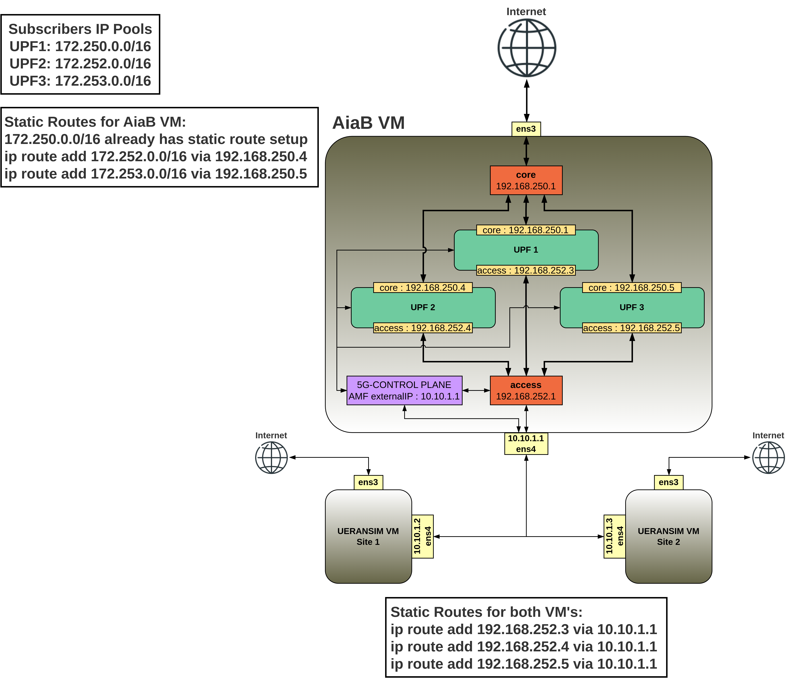
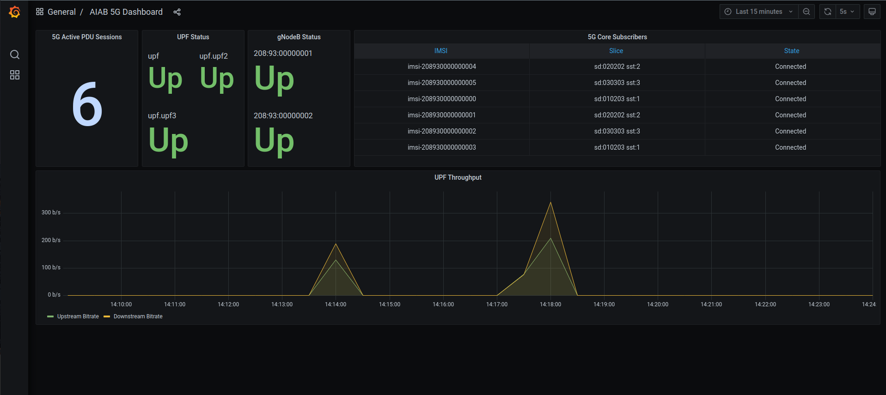

# Adding a new UPF in AiaB VM


| UPF | Access Interface | Core Interface   | IP Pool        |
|-----|------------------|------------------|----------------|
| 1   | 192.168.252.3/24 | 192.168.250.3/24 | 172.250.0.0/16 |
| 2   | 192.168.252.4/24 | 192.168.250.4/24 | 172.252.0.0/16 |
| 3   | 192.168.252.5/24 | 192.168.250.5/24 | 172.253.0.0/16 |

---

1. Create a new namespace for the new UPF (upf2 in this example)

```
kubectl create namespace upf2
```
2. Create a new helm chart (upf2.yaml) for the new UPF. Keep in mind we have to give new IP addresses for the core and access interfaces. They will be anchored to the DATA_IFACE interface.
```
enable: true
resources:
  enabled: false
images:
  repository: "registry.opennetworking.org/docker.io/"
config:
  upf:
    name: "oaisim"
    sriov:
      enabled: false #default sriov is disabled in AIAB setup
    hugepage:
      enabled: false #should be enabled if dpdk is enabled
    cniPlugin: macvlan
    ipam: static
    routes:
      - to: "10.0.30.53" #This is the IP of my internet facing interface (ens3) . Replace this address with yours
        via: 169.254.1.1
    enb:
      subnet: "10.10.1.0/24" #this is your gNB network
    access:
      iface: "ens4"
      ip: "192.168.252.4/24" #New IP address for UPF2 access interface
    core:
      iface: "ens4"
      ip: "192.168.250.4/24" #New IP address for UPF2 core interface
    cfgFiles:
      upf.json:
        mode: af_packet  #this mode means no dpdk
        hwcksum: true
        log_level: "trace"
        gtppsc: true #extension header is enabled in 5G. Sending QFI in pdu session extension header
        cpiface:
          dnn: "internet" #keep it matching with Slice dnn
          hostname: "upf"
          #http_port: "8080"
          enable_ue_ip_alloc: false # if true then it means UPF allocates address from below pool
          ue_ip_pool: "172.250.0.0/16" # UE ip pool is used if enable_ue_ip_alloc is set to true
```

3. Bring the new UPF up. After the first deployment you have to use "upgrade"
```
helm install/upgrade -f upf2.yaml upf2 aether/bess-upf --namespace upf2
```
Verify the pods are running with: _kubectl get pods -n upf2_.

4. The next steps involve the Aether ROC GUI. Screenshots with the correct configurations are provided [here](/scenario_1/images/).
    1. Add a new IP pool for the UPF subscribers (Configuration -> IP Domain).
    2. Create the new sim cards and devices if you've provisioned new imsi's. Here are the [instructions](https://docs.aetherproject.org/master/operations/subscriber.html).
    3. Create a new device group for the devices that belong together for each UPF/Slice.
    4. Create the new UPF. Keep in mind that the Config Endpoint should be **http://upf-http.\<namespace\>.svc:8080**. and Address should be **upf.\<namespace\>**. Insert the namespace of your new UPF (upf2).
    5. Create a new slice and associate the newly created UPF to it.

5. Now we have to establish two static routes. One in the AiaB VM and other in the UERANSIM VM

Aiab VM - We need to establish a route to the UPF subscribers, via their UPF Core interface.
```
ip route add 172.252.0.0/16 via 192.168.250.4
```
UERANSIM VM - Setup a static route to the new UPF Access interface via DATA_IFACE.
```
sudo ip route add 192.168.252.4 via 10.10.1.1
```
---

At the end, you should end up with a newly working UPF. You can check the Grafana dashboard to verify that the UPF is up.

