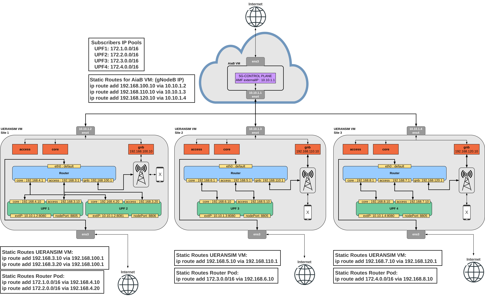
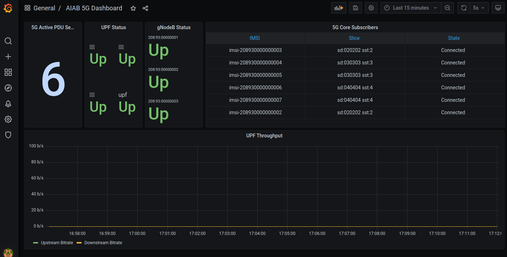

## Adding a new UPF in another VM


| UPF | Access Interface | Core Interface   | IP Pool        |
|-----|------------------|------------------|----------------|
| 1   | 192.168.3.10 | 192.168.4.10 | 172.1.0.0/16 |
| 2   | 192.168.3.20 | 192.168.4.20 | 172.2.0.0/16 |
| 3   | 192.168.5.10 | 192.168.6.10 | 172.3.0.0/16 |
| 4   | 192.168.7.10 | 192.168.8.10 | 172.4.0.0/16 |

As per my setup, this new edge sites requires an additional router pod to handle the traffic between the new interfaces. The site 1 is depicted as having two UPF's but I have not yet managed to realize this scenario, but will update this as soon as im able to. Will appreciate any feedback on how to make this possible or on how to simplify the routing.
The following steps recreate the deployment of the UPF 3, on site 2. 

---

1. Install RKE2 kubernetes distribution.

    You can follow [this guide](https://docs.google.com/document/d/1-BT7XqVsL7ffBlD7aweYaScKDQH7Gv5tHKt-sJGuf6c/edit#heading=h.9660fbbf0lyk), or simply clone the AiaB repository and install it with it's make file, which already simplifies the installation process, and will also download all the helm charts you'll need.

```
git clone "https://gerrit.opencord.org/aether-in-a-box"
cd ~/aether-in-a-box
make node-prep
```

2. Change the Router yaml file to reflect the correct IP addresses of it's interfaces (core, access, gnb) and add the subscriber static routes

```
...
spec:
  config: '{
    "cniVersion": "0.3.1",
    "type": "macvlan",
    "master": "ens4",       # REPLACE HERE WITH THE NAME OF YOUR INTERFACE
    "ipam": {
        "type": "static"
    }
  }'
---
apiVersion: v1
kind: Pod
metadata:
  name: router
  labels:
    app: router
  annotations:
    k8s.v1.cni.cncf.io/networks: '[
            { "name": "router-net", "interface": "core-gw", "ips": ["192.168.6.1/24"] },     # core interface IP
            { "name": "router-net", "interface": "ran-gw", "ips": ["192.168.110.1/24"] },    # gnb interface IP
            { "name": "router-net", "interface": "access-gw", "ips": ["192.168.5.1/24"] }    # access interface IP
    ]'
spec:
  containers:
  - name: router
    command: ["/bin/bash", "-c"]
    args:
      - >
        sysctl -w net.ipv4.ip_forward=1;
        iptables -t nat -A POSTROUTING -o eth0 -j MASQUERADE;
        ip route add 172.3.0.0/16 via 192.168.6.10;                    # Static route to redirect the subscribers to the UPF Core interface
        trap : TERM INT; sleep infinity & wait
    image: opencord/quagga
    securityContext:
      privileged: true
      capabilities:
        add:
          - NET_ADMIN
```

3. Change the UPF yaml file to have the correct interfaces IP's and give it an external IP, so that it can connect to the AiaB VM

```
enable: true
resources:
  enabled: false
images:
  repository: "registry.opennetworking.org/docker.io/"
config:
  upf:
    name: "oaisim"
    sriov:
      enabled: false #default sriov is disabled in AIAB setup
    hugepage:
      enabled: false #should be enabled if dpdk is enabled
    cniPlugin: macvlan
    ipam: static
    enb:
      subnet: "192.168.110.0/24"             # This is your gNB network
    access:
      iface: "ens4"                          # Interface
      ip: "192.168.5.10/24"                  # New IP address for UPF3 access interface
      gateway: "192.168.5.1"                 # Router IP
    core:
      iface: "ens4"                          # Interfce
      ip: "192.168.6.10/24"                  # New IP address for UPF3 core interface
      gateway: "192.168.6.1"                 # Router IP
    cfgFiles:
      upf.json:
        mode: af_packet  #this mode means no dpdk
        hwcksum: true
        log_level: "trace"
        gtppsc: true #extension header is enabled in 5G. Sending QFI in pdu session extension header
        measure_upf: false #enable packet processing time
        cpiface:
          dnn: "internet" #keep it matching with Slice dnn
          hostname: "upf"
          #http_port: "8080"
          enable_ue_ip_alloc: false # if true then it means UPF allocates address from below pool
          ue_ip_pool: "172.250.0.0/16" # UE ip pool is used if enable_ue_ip_alloc is set to true

service:
  externalIp: "10.10.1.3"    # External IP. This is the IP that will be given to the Aether ROC GUI.
```

4. Create three new interfaces (access, core, gnb). Do not give them any IP address on the VM interfaces, we only want the router and UPF to communicate in them.
  
    This process is described here step by step for each interface for ease of understanding, but you should make these changes permanent via [systemd](https://gist.github.com/timcharper/d547fbe13bdd859f4836bfb02197e295). The gnb interface has an IP so that the UERANSIM gNodeB can attach to it.

```
sudo ip link add access link ens4 type macvlan mode bridge
sudo ip link add core link ens4 type macvlan mode bridge
sudo ip link add gnb link ens4 type macvlan mode bridge
sudo ip addr add 192.168.100.10/24 dev gnb
sudo ip link set access up
sudo ip link set core up
sudo ip link set gnb up
```

5. Deploy the Router.
```
kubectl apply -f router.yaml
```

6. Deploy the UPF. After the first time, use upgrade instead of install.
```
helm install/upgrade -f upf2.yaml upf2 aether/bess-upf
```

7. Configure the new UPF via Aether ROC GUI. Images with the correct configuration are provided [here](/scenario_2/images/).

    This requires that you provide the external IP of the UPF in the UPF configuration page.

8. Static Routes.

    We need to add two new static routes. One for the AiaB VM, so that it can connect to our gNodeB and other one for the Edge VM, so that the UE's are redirected to the UPF access interface.
    
    AiaB VM
    ```
    ip route add 192.168.110.10 via 10.10.1.3
    ```
    UERANSIM VM
    ```
    ip route add 192.168.5.10 via 192.168.110.1 
    ```

9. Start UERANSIM gNodeB and UE and verify that it recieves the correct subscribers pool IP and that it has Internet connectivity.

---

Grafana Dashboard confirming the PDU sessions. The Edge UPF's have their name unformatted. I've yet to figure out how to fix it.


